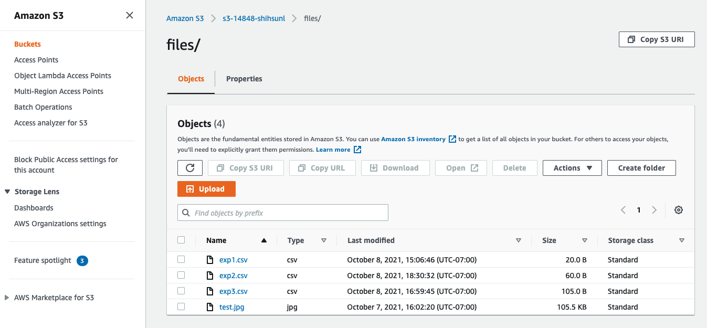
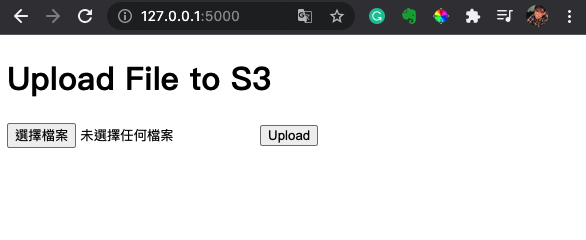
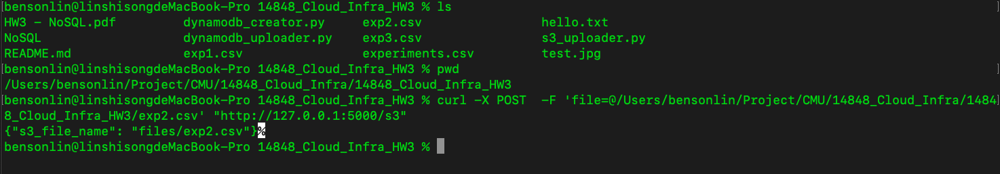
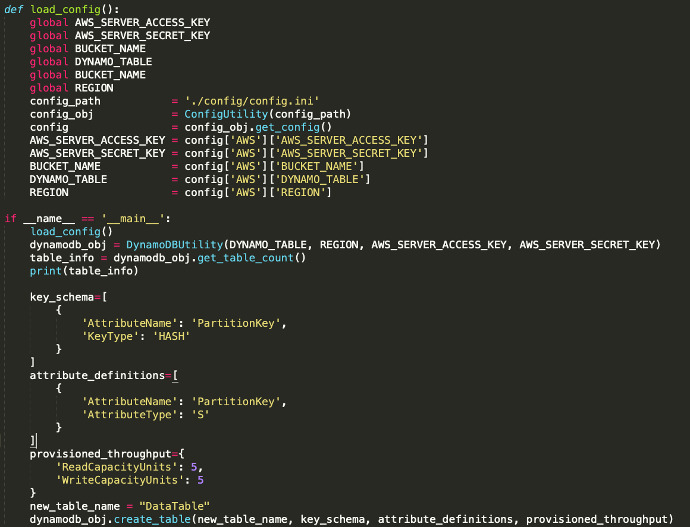
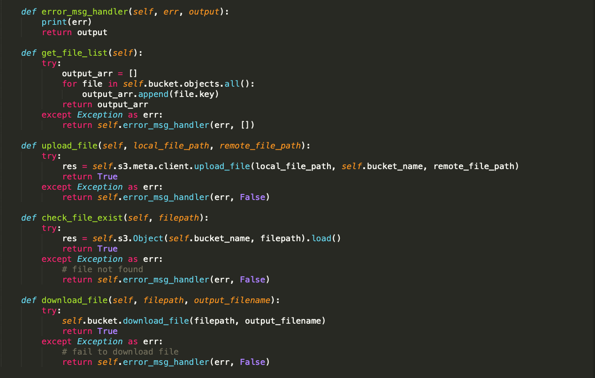

# 14848_Cloud_Infra_HW3
- For this project, I create a Restful API server to query and upload data to AWS S3 and DynamoDB

# How to use?
## Use Restful API Server
### Install requirements
- Command:
```
cd NoSQL
pip3 install -r requirements.txt # for Ubuntu 18.04
pip3 install -r requirements_macos.txt # for macOS Catalina 10.15.6
```

### Configuration setup
- Copy `NoSQL/config/config.template.ini` file and rename to `NoSQL/config/config.ini`
- Modify `AWS_SERVER_ACCESS_KEY`, `AWS_SERVER_SECRET_KEY`, `BUCKET_NAME`, `DYNAMO_TABLE`, `REGION` in `config.ini`

### Create S3 bucket and DynamoDB Table
- Use AWS Management Console Web


- Or you can use python code to create a DynamoDB Table and a S3 bucket
```
cd NoSQL
python3 s3_bucket_creator.py
python3 dynamodb_creator.py
```

### Launch RESTful API Server
- Command:
```
cd NoSQL
python3 app.py
```
- Once you launch the server, you can access the server with port 5000


### Test RESTful API Server
- Open a browser and use: 127.0.0.1:5000 to access the test website


### Upload Blob data to AWS S3
- use exp2.csv data as an example:
```
Id,Additional_Conductivity,New_Temperature
2,67.5,-3.1
```
- Command:
```
curl -X POST  -F 'file=@/path/to/exp2.csv' "http://127.0.0.1:5000/s3"
The API will return the remote file path
```
- Result:


### Upload experiments.csv to update DynamoDB table
- experiments.csv data:
```
Id,Temp,Conductivity,Concentration,URL
1,-1,52,3.4,exp1.csv
2,-2,52.1,3.4,exp2.csv
3,-2.93,57.1,3.7,exp3.csv
```
- Command:
```
curl -X POST  -F 'file=@path/to/experiments.csv' "http://127.0.0.1:5000/table"
The API will return the data info in the DynamoDB table
```
- Result:


### Get S3 file structure
- Command:
```
curl "http://127.0.0.1:5000/s3"
The API will return the s3 file structure
```

### Query the row data in DynamoDB Table
- Command:
```
curl "http://127.0.0.1:5000/table?keyname=PartitionKey&keyval=1"
The API will return the row data
```
- Result:


### Download the file from AWS S3
- Once you query the data in DynamoDB Table, you will get the remote file path. You can download the file by using the API below.
- Command:
```
curl "http://127.0.0.1:5000/downloads3/files/exp2.csv"
or
curl "http://127.0.0.1:5000/downloads3/files/exp2.csv" -o ./exp2.csv
```
- Result:


-------

## Code Inspection
- For creating a DynamoDB table, you can check `dynamodb_creator.py`. It will create DynamoDB table named DataTable.


- For creating a S3 bucket, you can check `s3_bucket_creator.py`. It will create S3 bucket named s3-14848-shihsunl and create 3 folders: files, log and test.


- In this API Server Project, I created an `aws_util` to initialize AWS resource.


- Then, I created a S3Utility class and DynamoDBUtility to encapsulate the function related to AWS S3 and DynamoDB (get data/upload file).




- User can simply use these two classes to access AWS S3 and DynamoDB to get data or upload data.


-------

## Use AWS CLI to Query DynamoDB Table
### Install AWS CLI
- Follow the instruction to install aws cli:
https://docs.aws.amazon.com/cli/latest/userguide/welcome-versions.html#welcome-versions-v2

- Set up AWS configuration:
https://docs.aws.amazon.com/cli/latest/userguide/cli-configure-quickstart.html

### Query the row data in DynamoDB Table
- Command:
```
aws dynamodb query --table-name DataTable --key-condition-expression "PartitionKey = :name" --expression-attribute-values  '{":name":{"S":"1"}}'
```

- Result:


